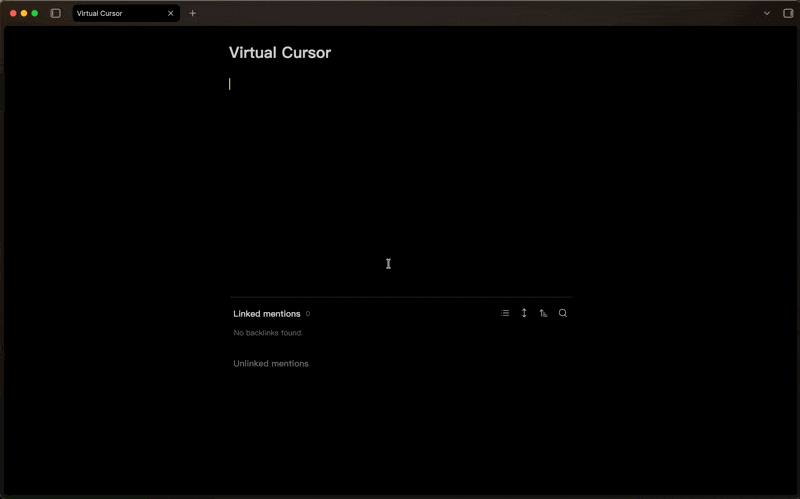

# Virtual Cursor

Virtual Cursor is an Obsidian plugin that renders a second, highly visible caret on top of the CodeMirror 6 editor. It helps you keep track of the insertion point when the default cursor is hard to spot, and you can recolor it with the Style Settings community plugin.

## Features
- Draws a floating cursor element that mirrors the current insertion point.
- Fades the cursor after a short delay to mimic a blink while keeping it visible between key presses.
- Responds to editor scroll, resize, and selection changes for accurate positioning.
- Integrates with the Style Settings plugin for one-click color customization (defaults to `--color-accent`).

## Style Settings
If you use the [Style Settings](https://github.com/mgmeyers/obsidian-style-settings) community plugin, a **Virtual Cursor** section will appear automatically with a single **Cursor color** control. Pick any color to override the accent tint.

Without Style Settings installed, the cursor falls back to Obsidian's accent color.

## License
Released under the MIT license. See [LICENSE](LICENSE) for details.
